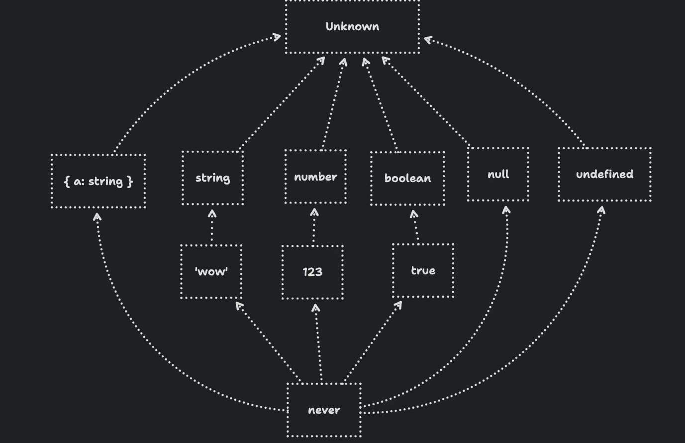

In TypeScript 2.0, a new 'never' primitive type was introduced.

We saw in one of the previous sections that there is a type named 'unknown' in TypeScript which is a top type, meaning that everything is assignable to 'unknown'.

The opposite of it is 'never'. No type is assignable to 'never', except 'never' itself. It is a bottom type.

Let's say we have this code -

    const get = () => {
        throw new Error('Hello World');
    }

What do you think the type of 'get' function is? If you think that it is '() => void' then you are wrong. If you hover over 'get', then its type will be '() => never'. And it actually makes sense because if you call this function, instead of returning something, it will throw an error. This means, it does not return anything at all, not even undefined.

So, we can say that for functions in TypeScript that never return, 'never' is the return type for them.

Like mentioned above, we cannot assign anything to 'never', except 'never' itself. So, if we have -

    const get = () => {
        throw new Error('Hello World');
    }

    const fn = (input: never) => {
        // Some code
    }

Now, if we call any of these, we will see an error in the IDE - 

    fn('Hello World');
    fn(42);
    fn({});
    fn([]);
    fn(() => {})

But, we can safely write - 

    fn(get())

That's because 'get' is a function that never returns, so it can be safely assigned to a variable of type 'never'.

It is also worth mentioning that unlike 'unknown' which cannot be assigned to some variable without narrowing or type assertion, we can assign 'never' to anything. So, all of these are valid in TypeScript -

    const str: string = get();
    const num: number = get();
    const obj: object = get();
    const arr: any[] = get();
    const fn1: () => void = get();

This is because 'never' is a bottom type while 'unknown' is a top type. So, keep this in mind -

    'unknown' can have any type assigned to it, but you cannot assign 'unknown' to any specific type (without a type assertion or narrowing).

    'never' cannot have any type assigned to it, but you can assign 'never' to any specific type.

Looking at the above diagram we can see how 'unknown' sits at the top and 'never' is at the bottom'. And if you follow the arrows, they show that 'never' can be assigned to any type in TypeScript. But since it is at the very bottom, nothing can be assigned to it. Similarly, since 'unknown' is at the top, it means any type can be assigned to 'unknown'. But, 'unknown' cannot be assigned to any type because it is at the very top (except type assertion or narrowing).

# SOLVING THE NEVER TYPE IN TYPESCRIPT

Let's take an example -

    const shoppingCart = {
        items: []
    };

    console.log(shoppingCart.items);

    shoppingCart.items.push("Apple");
    shoppingCart.items.push("Banana");

At first glance, it looks like nothing is wrong with this code. But, the IDE will show an error when we try to push in the array -

    Argument of type '"Apple"' is not assignable to parameter of type 'never'.
    Argument of type '"Banana"' is not assignable to parameter of type 'never'.

Interestingly, the type of 'items' is 'never[]'. So, it is an array of 'never'.

Why does this happen?

That's because when we defined 'items' in our 'shoppingCart' object, we simply assigned it an empty array. We never gave it any type from our side and in TypeScript, the type of an empty array is 'never[]'. This means that the array is inferred to be an array of 'never', which is why we cannot push any values into it because remember that 'never' is a bottom type so we cannot assign any type to it.

If we had something like - 

    const shoppingCart = {
        items: ['Orange']
    };

In this case, 'items' would be of type 'string[]' instead of 'never[]'.

So, how do we fix this issue? Because in a lot of cases in our applications, we start with empty arrays.

Well, we can tell TypeScript that the 'shoppingCart' object will have an 'items' property which will be a string array. 

    const shoppingCart: {
        items: string[]
    } = {
        items: []
    };

To make it simpler, we can extract the type of the 'shoppingCart' object into a separate type alias:

    type ShoppingCart = {
        items: string[]
    };

    const shoppingCart: ShoppingCart = {
        items: []
    };

And now, TypeScript knows that even though 'items' is an empty array to begin with, it will always be a string array. This allows us to push strings into it without any issues.

# NARROWING RETURN TYPES WITH TYPESCRIPT

Let's say we have this piece of code -

    const throwError = (message: string): undefined => {
        throw new Error(message);
    }

    const handleSearchParams = (params: { id?: string }): string => {
        const id = params.id || throwError("No ID provided");
        return id;
    }

Here, we have a 'throwError' function which takes a message and it simply throws a new error with that message.

Then, we have a 'handleSearchParams' function which takes an object with an optional 'id' property. If the 'id' is not present, it calls the 'throwError' function to throw an error.

This function is supposed to return a string but right now, we get an error saying -

    Type 'string | undefined' is not assignable to type 'string'.

And the reason is that 'throwError' currently returns 'undefined'. That's why the type of 'id' variable is inferred by TypeScript as 'string | undefined'.

But, this does not make much sense. Because, if you think about it, since 'throwError' simply throws an error, it will never return anything. It will not even return undefined. The issue in our code is that we have given the return type of 'throwError' as 'undefined' instead of 'never'.

To fix this, we can change the return type of 'throwError' to 'never':

    const throwError = (message: string): never => {
        throw new Error(message);
    }

Now, if we go back to our 'handleSearchParams' function, the type of 'id' variable will be inferred as 'string' because 'throwError' will never return a value. So, TypeScript now understands that 'id' can only be a string and not undefined.

In fact, if we had a type like this -

    type Example = string | never;

You will see that if you hover over 'Example', it will show 'string' as the type. That's because 'never' is a bottom type so it is assignable to anything above it (remember the image?) And so, when we write 'string | never', the result is basically just 'string'. This is something similar to writing -

    type Example = 'abc' | 'xyz' | string

In this case as well, the result is just 'string' because 'abc' and 'xyz' are both assignable to 'string'. So, they are ignored from this union.Same is the case with 'string | never' in the example above.

Instead of explicitly writing the return type as 'never' for our handleError, we can let TypeScript infer the return type by not even specifying it:

    const handleError = (message: string) => {
        throw new Error(message);
    }

Here, TypeScript will automatically infer the return type as 'never' because the function always throws an error and never returns a value.