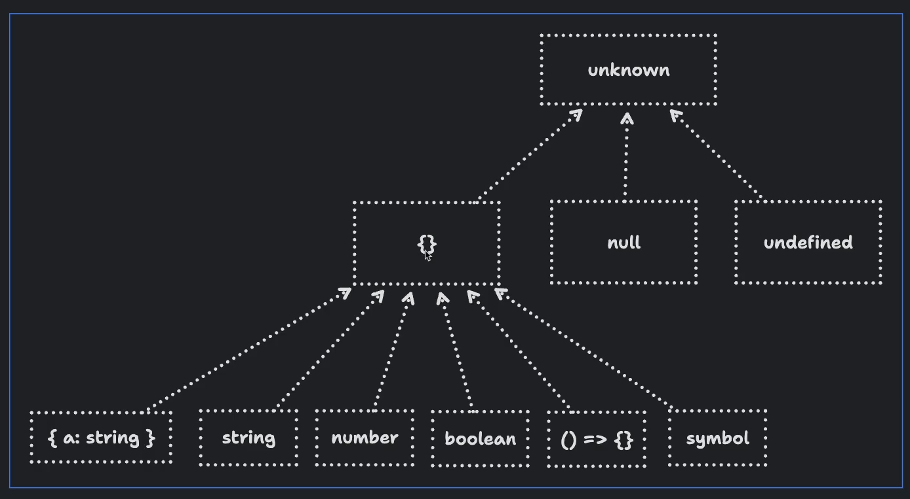

Let's say that we have a function that can accept any value -

    const acceptAnythingExceptNullOrUndefined = (input) => {};

Now, we want to make sure that it can accept anything except 'null' or 'undefined'.

Hmm... how do we do that? Because right now, we can call it like this -

    acceptAnythingExceptNullOrUndefined(123);
    acceptAnythingExceptNullOrUndefined("Hello");
    acceptAnythingExceptNullOrUndefined(true);
    acceptAnythingExceptNullOrUndefined({});
    acceptAnythingExceptNullOrUndefined([]);
    acceptAnythingExceptNullOrUndefined(() => {});
    acceptAnythingExceptNullOrUndefined(new Error('foo'));
    acceptAnythingExceptNullOrUndefined(/foo/);

    // @ts-expect-error
    acceptAnythingExceptNullOrUndefined(null);

    // @ts-expect-error
    acceptAnythingExceptNullOrUndefined(undefined);

Right now the @ts-expect-error directive will show an error and as we know, it shows an error whenever the line below it does NOT produce an error. But in this case, we want it to produce an error because we don't want to allow 'null' or 'undefined'.

So, how do we disallow 'null' or 'undefined'? In other words, how do we accept anything except 'null' or 'undefined'?

What if we type 'input' to 'any' or 'unknown'?

    const acceptAnythingExceptNullOrUndefined = (input: any) => {};
    // or
    const acceptAnythingExceptNullOrUndefined = (input: unknown) => {};

Well, that won't work because both 'any' and 'unknown' can accept 'null' or 'undefined'.

# THE SOLUTION

There is a very interesting solution to this problem.

We can do -

    const acceptAnythingExceptNullOrUndefined = (input: {}) => {};

Wait, what? What did we just do?

We type input as an empty object and instantly, now we can see that both 'null' and 'undefined' are producing errors while everything else is perfectly fine!

In TypeScript's type system, everything is considered to be an object except for 'null' and 'undefined'. So, by typing 'input' as an empty object '{}', we are effectively saying that it can accept anything that is an object, which excludes 'null' and 'undefined'.

The above diagram basically shows the type hierarchy in TypeScript.

So, at the very top, we have the 'unknown' type which can accept anything.

Then, there is the empty object type '{}' which can accept anything except for 'null' and 'undefined'.

Everything apart from 'null' and 'undefined' is assignable to the empty object type '{}'.

So, in TypeScript, we can say that on the second level of the type hierarchy, we have basically three types -

    1. The empty object type '{}'
    2. The 'null' type
    3. The 'undefined' type

# TYPING A TRULY EMPTY OBJECT TYPE

Okay, so we have seen that we can use the empty object type '{}' to accept anything except for 'null' and 'undefined'.

Now, what if we have a function that should only accept a truly empty object? This means, it should only accept an object that has no properties at all.    

    acceptOnlyEmptyObject = (input: {}) => {};

Right now, this function can accept any object, even if it has properties -

    acceptOnlyEmptyObject({}); // okay
    acceptOnlyEmptyObject({ a: 123 }); // okay
    acceptOnlyEmptyObject({ a: 123, b: "Hello" }); // okay

We basically want to restrict it to only accept an empty object '{}'-

    acceptOnlyEmptyObject({}); // Only this should be okay

We can use a 'Record' type here. But how? We know that a 'Record' type takes two type parameters - the first one is the type of the keys and the second one is the type of the values.

But in our case, an empty object has no keys and no values. So, how do we represent that?

Well, we can use the 'never' type here like this -

    acceptOnlyEmptyObject = (input: Record<PropertyKey, never>) => {};

What just happened?

We basically said that the keys of the object should be of type 'PropertyKey' (string or number or symbol) and the values should be of type 'never'.

And as we know, 'never' sits at the very bottom of the type hierarchy. This means that there is no value that can be assigned to 'never'. So, even though we defined a record type with 'PropertyKey' keys, there is no way we can have any keys because there is no value that can be assigned to 'never'. In this way, we are limiting the passed object to have no keys and no values.